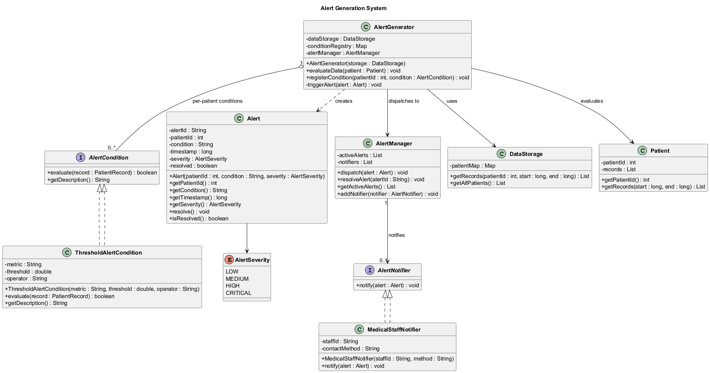
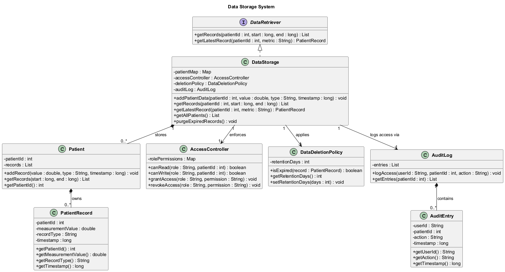
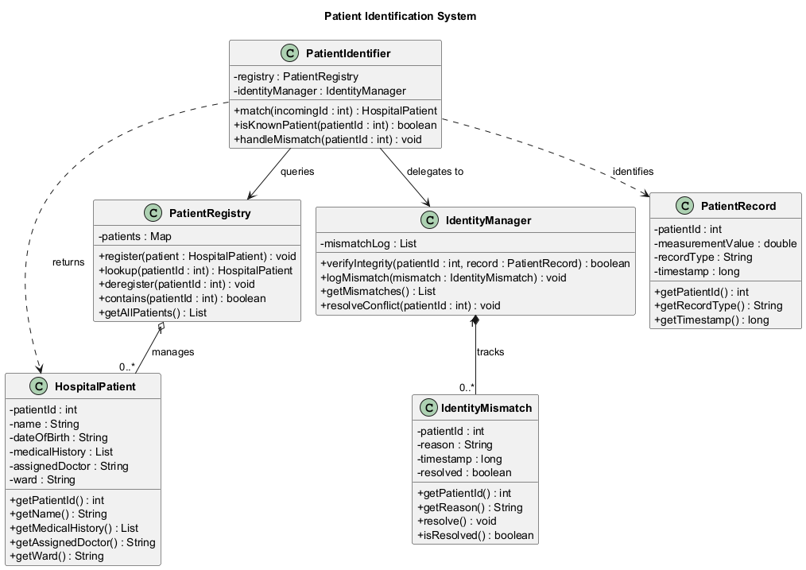
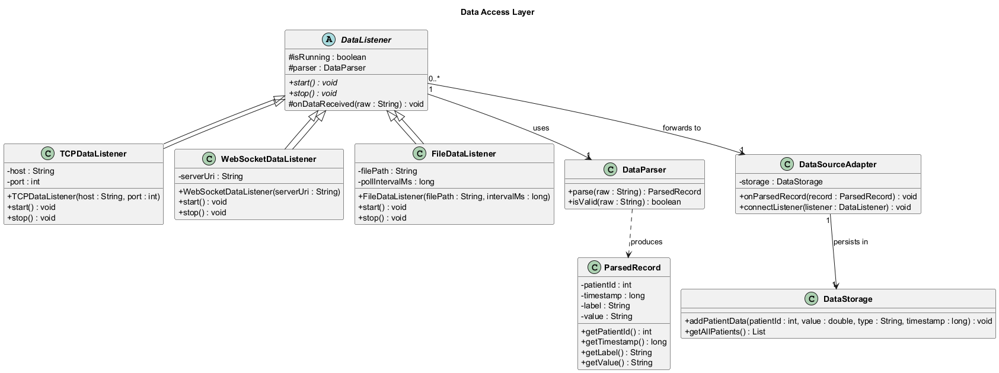

# UML Class Diagram Descriptions

---

## 1. Alert Generation System

The Alert Generation System is responsible for monitoring real-time patient vitals and dispatching alerts when thresholds are exceeded. The central class, `AlertGenerator`, holds a reference to `DataStorage` and a per-patient registry of `AlertCondition` objects. When `evaluateData()` is called, it retrieves recent records for a patient, evaluates them against every registered condition, and creates an `Alert` object if any condition is met.

`AlertCondition` is modeled as an interface so that multiple rule types can coexist. The concrete `ThresholdAlertCondition` implements a simple comparison (e.g., heart rate above 130 bpm), but new condition types can be added without touching `AlertGenerator`. This follows the Open/Closed Principle and mirrors the Strategy Pattern.

`Alert` is a self-contained value object carrying the patient ID, condition description, timestamp, and `AlertSeverity` (an enum with four levels: LOW, MEDIUM, HIGH, CRITICAL). Severity allows `AlertManager` to prioritize and route alerts differently depending on urgency. The `resolved` flag ensures alerts are tracked through their full lifecycle.

`AlertManager` decouples dispatch logic from evaluation. It maintains a list of active alerts and a list of `AlertNotifier` implementations. The `AlertNotifier` interface hides the specifics of how staff are reached (pager, screen, log), keeping the rest of the system free from communication details. `MedicalStaffNotifier` is one concrete implementation.

The aggregation between `AlertGenerator` and `AlertCondition` (0..*) reflects that patients may have zero or many conditions registered. The use of an enum for severity and an interface for conditions keeps the design extensible without sacrificing clarity.

---

## 2. Data Storage System

The Data Storage System provides a centralized, secure, and auditable repository for all incoming patient health records. It is designed with privacy-by-design principles and supports both real-time monitoring and historical trend analysis.

`DataStorage` implements the `DataRetriever` interface, which enforces a clean contract for data access. This means any client that needs to query records depends on the interface, not the concrete class — making it straightforward to swap the storage backend (e.g., from in-memory to a database) without touching client code.

Patient records are organized through a strict ownership hierarchy: `DataStorage` contains `Patient` objects (composition), and each `Patient` owns its `PatientRecord` list (composition). This mirrors the real-world relationship and allows efficient time-range queries to be handled at the patient level.

`AccessController` enforces role-based access control, ensuring that only authorized roles (such as doctors or nurses) can read or write specific patient data. This addresses the CHMS privacy requirement by preventing sensitive medical data from being exposed to components that have no need for it.

`DataDeletionPolicy` encapsulates retention logic independently from the storage class. By separating policy from storage, the system can comply with regulatory requirements (e.g., data retention limits) without modifying `DataStorage` directly.

`AuditLog` and `AuditEntry` provide an immutable trail of every access event, recording which user accessed which patient's data and when. This is critical in a hospital setting for accountability and forensic investigation. The composition of `AuditLog` with `AuditEntry` (0..*) ensures audit records are owned by and cannot outlive the log.

---

## 3. Patient Identification System

The Patient Identification System bridges the numeric patient IDs produced by the simulator and the actual hospital patient database. Its core purpose is to guarantee that every incoming data point is attributed to the correct patient, and that any mismatch is recorded and handled explicitly rather than silently dropped.

`PatientIdentifier` is the single entry point for identification requests. It takes an incoming patient ID, queries `PatientRegistry`, and returns the corresponding `HospitalPatient`. If no match is found, it delegates to `IdentityManager` to log the anomaly and initiate a resolution process.

`HospitalPatient` holds the full hospital record for a patient: demographics, medical history, assigned doctor, and ward. All fields are private, and only the necessary getters are exposed. This protects sensitive data and ensures that personal information is not accessible from parts of the system that have no legitimate need for it.

`PatientRegistry` acts as an in-memory cache of known patients, implemented as a map for fast O(1) lookups. It supports dynamic registration and deregistration to reflect a live hospital environment where patients are admitted and discharged continuously.

`IdentityManager` handles the integrity layer. It validates incoming records against known patient profiles and maintains a log of `IdentityMismatch` objects. Each mismatch records the patient ID, the reason for the failure, the timestamp, and a resolution flag. This makes anomalies traceable and auditable rather than invisible.

The key design decision here is that `PatientIdentifier`, `PatientRegistry`, and `IdentityManager` each have a single, well-defined responsibility. No class both stores data and decides how to handle errors. This makes each component independently testable and easier to extend.

---

## 4. Data Access Layer

The Data Access Layer abstracts the specifics of how data arrives from the signal generator, supporting three transport modes: TCP socket, WebSocket, and file-based log reading. The rest of the CHMS is completely unaware of which transport is active, making it easy to switch or run multiple channels simultaneously.

`DataListener` is an abstract class that defines the common interface (`start()`, `stop()`) and holds a reference to a shared `DataParser` instance. It also implements `onDataReceived()`, the callback invoked whenever raw data arrives — this shared behavior is kept in the base class to avoid duplication across all three subclasses.

Three concrete subclasses handle each transport:
- `TCPDataListener` connects to the generator's TCP server and reads a continuous byte stream.
- `WebSocketDataListener` subscribes to the generator's WebSocket server for push-based updates.
- `FileDataListener` polls a log file at a configurable interval, reading newly appended lines.

`DataParser` is the sole class responsible for transforming raw string data (e.g., `1,1714376789050,HeartRate,72`) into structured `ParsedRecord` objects. Centralizing parsing here means the format can evolve in one place without touching the listeners or the storage layer.

`DataSourceAdapter` acts as the bridge between the access layer and the rest of the system. It receives `ParsedRecord` objects from any listener and translates them into calls to `DataStorage.addPatientData()`. This prevents any listener from having direct knowledge of how data is persisted.

The key design decision is using an abstract base class rather than an interface for `DataListener`. This allows shared behavior (`onDataReceived`) to be inherited directly, reducing boilerplate in each subclass while still enforcing the `start()` and `stop()` contract through abstract methods.
